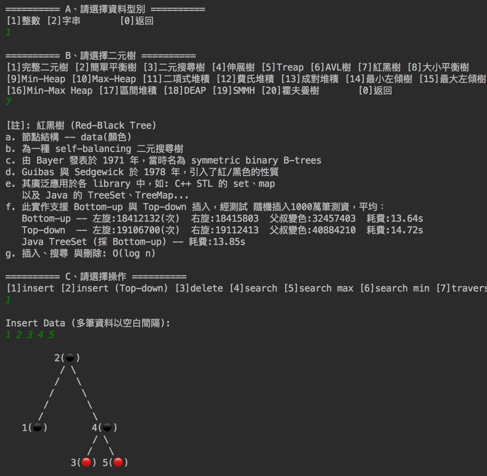

# binary-tree
An example of a binary tree written in java

---

## Demo


---

## Getting Started

You can download the <a href="https://github.com/JS-Zheng/binary-tree/raw/master/out/artifacts/binary_tree_jar/binary-tree.jar">binary-tree.jar</a> directly and execute: 
```
java -jar /path/to/binary-tree.jar
```
